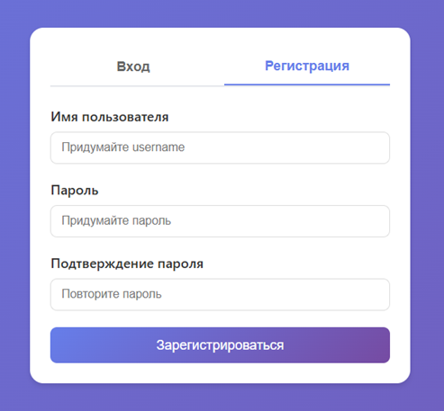
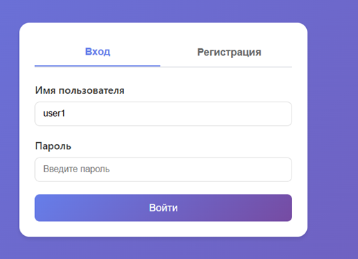
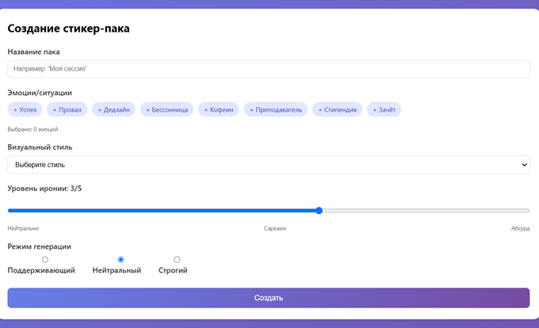
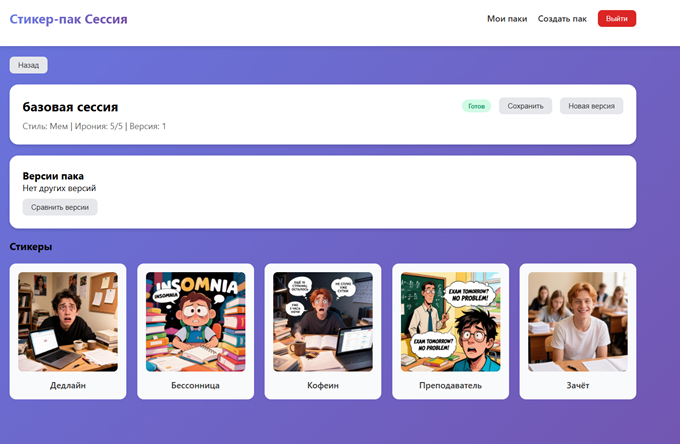
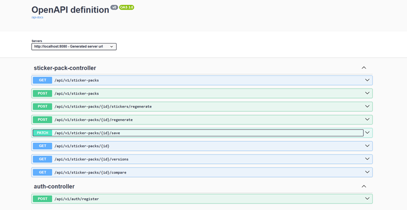

# Веб-сервис «Стикер-пак Сессия»

## Аннотация

Каждую сессию в студенческих чатах происходит одно и то же. Кто-то пишет «я сдаю», кто-то «я не успеваю», кто-то «я гений». А дальше весь чат общается с помощью одних и тех же реакций, мемов и картинок, которые уже морально устарели. Админы чатов мечтают о свежем наборе стикеров под текущую сессию, но рисовать вручную никто не собирается, да и вкусы у всех разные.
Веб-сервис «Стикер-пак Сессия» позволяет быстро собирать тематические стикер-паки под конкретный вайб и набор эмоций. Зарегистрированный пользователь задаёт список эмоций или ситуаций, выбирает стиль и уровень иронии, после чего получает серию изображений-стикеров, объединённых в один пакет. Пользователь может хранить созданные паки, возвращаться к ним, перегенерировать отдельные стикеры или выпускать новую версию того же пака с другими настройками.

---

## 1. Функциональные требования

Система обеспечивает:

| № | Требование |
|---|------------|
| 1 | Регистрацию и аутентификацию пользователей — Basic Authentication с хешированием паролей BCrypt |
| 2 | Создание нового стикер-пака на основе введённого набора эмоций/ситуаций |
| 3 | Управление параметрами генерации (визуальный стиль, уровень иронии, режим анализа) |
| 4 | Формирование результата в виде набора стикеров, объединённых в один пакет |
| 5 | Отображение статуса обработки: PROCESSING, SUCCESS, ERROR |
| 6 | Просмотр истории собственных паков и их версий с фильтрацией и поиском |
| 7 | Сохранение выбранных паков (избранное) |
| 8 | Повторную генерацию паков и/или отдельных стикеров с изменёнными параметрами |
| 9 | Сравнение версий одного и того же пака, полученных при разных настройках |

---

## 2. Стек технологий

| Компонент | Технология |
|-----------|------------|
| Язык программирования | Java 21 |
| Фреймворк | Spring Boot 3.2.5 |
| Веб-слой | Spring Web (REST API, Tomcat) |
| База данных | PostgreSQL |
| ORM | Spring Data JPA / Hibernate |
| Безопасность | Spring Security (Basic Auth, BCrypt) |
| Интеграция с AI | GigaChat Java SDK 0.1.15 |
| Документация API | Springdoc OpenAPI (Swagger) |
| Повторные попытки | Spring Retry |
| Переменные окружения | dotenv-java |
| Клиентский интерфейс | HTML/CSS/JavaScript |
| Сборка | Maven |
| Тестирование | JUnit 5, Mockito, H2 |

---

## 3. Архитектура приложения

Проект разделён на несколько логических слоёв:

| Слой | Компоненты |
|------|------------|
| **controller** | `AuthController`, `StickerPackController` - REST-контроллеры |
| **facade** | `StickerPackFacade` - фасад, скрывающий сложность подсистемы генерации |
| **service** | `UserService`, `RateLimitService`, `AccessControlService`, `StickerGenerationOrchestrator` - бизнес-логика |
| **proxy** | `AuditableGigaChatProxy` - заместитель для аудита вызовов GigaChat API |
| **impl** | `GigaChatImageServiceImpl` - адаптер для интеграции с GigaChat API |
| **strategy** | `PromptStrategy`, `NeutralPromptStrategy`, `SupportivePromptStrategy`, `StrictPromptStrategy` - стратегии формирования промптов |
| **repository** | `UserRepository`, `StickerPackRepository`, `GigaChatAuditRepository` - доступ к базе данных |
| **entity** | `UserEntity`, `StickerPackEntity`, `StickerEntity`, `GigaChatAuditLog` - JPA-сущности |
| **dto** | `StickerPackRequest`, `StickerPackResponse`, `StickerPackDetailResponse`, `StickerPackVersionDTO`, `StickerResponse` - DTO для обмена данными |
| **exception** | `RateLimitException` - обработка ошибок |
| **config** | `SecurityConfig`, `GigaChatConfig`, `DotenvConfig`, `CustomUserDetailsService` - конфигурации |
| **static** | `web.html` - пользовательский интерфейс |
| **test** | Unit- и интеграционные тесты |

---

## 4. Основные классы проекта

### 4.1. StickerPackProject
Главный класс запуска Spring Boot приложения. Аннотирован `@SpringBootApplication`, `@EnableAsync`, `@EnableRetry`. Инициализирует Spring-контекст, поднимает встроенный Tomcat, подключает контроллеры, сервисы и репозитории.

### 4.2. Контроллеры (Controller)

#### 4.2.1. StickerPackController
REST-контроллер для работы со стикер-паками.

| Endpoint | Метод | Описание |
|----------|-------|----------|
| `/api/v1/sticker-packs` | POST | Создание нового пака |
| `/api/v1/sticker-packs` | GET | Получение истории паков пользователя |
| `/api/v1/sticker-packs/{id}` | GET | Получение деталей пака |
| `/api/v1/sticker-packs/{id}/regenerate` | POST | Создание новой версии пака |
| `/api/v1/sticker-packs/{id}/stickers/regenerate` | POST | Перегенерация одного стикера |
| `/api/v1/sticker-packs/{id}/save` | PATCH | Сохранение/отмена сохранения пака |
| `/api/v1/sticker-packs/{id}/versions` | GET | Список версий пака |
| `/api/v1/sticker-packs/{id}/compare` | GET | Данные для сравнения версий |

#### 4.2.2. AuthController
REST-контроллер для регистрации пользователей.

| Endpoint | Метод | Описание |
|----------|-------|----------|
| `/api/v1/auth/register` | POST | Регистрация нового пользователя |

### 4.3. Фасад (Facade)

#### StickerPackFacade
Фасад, скрывающий сложность подсистемы: работа с БД, GigaChat, проверку лимитов, обработку ошибок, версионирование и формирование DTO. Содержит методы:
- `createStickerPack()` - создание нового стикер-пака
- `regenerateStickerPack()` - создание новой версии пака
- `regenerateSingleSticker()` - перегенерация одного стикера
- `getUserStickerPacks()` - получение истории паков пользователя
- `getPackById()` - получение деталей пака
- `saveStickerPack()` - сохранение/отмена сохранения
- `getPackVersions()` - получение списка версий
- `getPackVersionsForComparison()` - получение данных для сравнения

### 4.4. Сервисы (Service)

#### 4.4.1. StickerGenerationOrchestrator
Оркестратор процесса генерации. Формирует промпт через фабрику стратегий, вызывает генерацию изображений, сохраняет результат.
- `orchestrate()` — полная генерация пака
- `regenerateOne()` — перегенерация одного стикера

#### 4.4.2. UserService
Сервис управления пользователями. Обеспечивает регистрацию, проверку существования пользователя и хеширование паролей.
- `registerUser()` — регистрация нового пользователя

#### 4.4.3. RateLimitService
Сервис ограничения количества запросов (дополнительная функциональность). Настраивается в `application.properties`.
- `checkLimit()` — проверка лимита запросов для пользователя

#### 4.4.4. AccessControlService
Сервис проверки доступа к генерации изображений. Фильтрует запрещённые эмоции.
- `canGenerateImage()` - проверка возможности генерации

#### 4.4.5. ImageGenerationService
Интерфейс сервиса генерации изображений. Определяет единый протокол для генерации.
- `generateStickerImage()` — генерация изображения по эмоции и промпту

### 4.5. Реализации сервисов (Impl)

#### GigaChatImageServiceImpl
Адаптер для GigaChat API. Реализует паттерн **Адаптер**. Преобразует вызовы `ImageGenerationService` в запросы к GigaChat, извлекает `fileId` из ответа и скачивает изображение. Аннотирован `@Retryable` для повторных попыток при сбоях.

### 4.6. Прокси (Proxy)

#### AuditableGigaChatProxy
Прокси-класс для аудита вызовов GigaChat API. Реализует паттерн **Заместитель**. Фиксирует каждый запрос в таблице `gigachat_audit_logs`, обрабатывает ошибки и проверяет доступ.

### 4.7. Стратегии (Strategy)

#### 4.7.1. PromptStrategy
Интерфейс стратегии формирования системного промпта.

#### 4.7.2. NeutralPromptStrategy
Нейтральный режим генерации. Создаёт спокойные, безоценочные описания ситуаций.

#### 4.7.3. SupportivePromptStrategy
Поддерживающий режим генерации. Создаёт добрые, подбадривающие стикеры.

#### 4.7.4. StrictPromptStrategy
Строгий (циничный) режим генерации. Отражает суровую реальность дедлайнов.

#### 4.7.5. PromptStrategyFactory
Фабрика стратегий. Создаёт контекст стратегии на основе переданного режима анализа.

#### 4.7.6. StickerPromptContext
Контекст выполнения стратегии. Делегирует вызов конкретной стратегии.

### 4.8. Конфигурации (Config)

#### 4.8.1. SecurityConfig
Конфигурация Spring Security. Настраивает цепочку фильтров безопасности, отключает CSRF, устанавливает stateless-сессии, определяет публичные эндпоинты и настраивает HTTP Basic Authentication.

#### 4.8.2. CustomUserDetailsService
Реализация `UserDetailsService`. Отвечает за загрузку данных пользователя из базы данных по его имени для последующей аутентификации.

#### 4.8.3. GigaChatConfig
Конфигурация клиента GigaChat. Создаёт бин `GigaChatClient` с настройками подключения и аутентификации.

#### 4.8.4. DotenvConfig
Загрузка переменных окружения из файла `.env`. Обеспечивает безопасное хранение ключа авторизации GigaChat.

### 4.9. DTO (Data Transfer Object)

| Класс | Назначение |
|-------|------------|
| `StickerPackRequest` | Входной DTO для создания/перегенерации пака |
| `StickerPackResponse` | Краткий ответ о паке (для списков) |
| `StickerPackDetailResponse` | Детальный ответ о паке (со стикерами) |
| `StickerPackVersionDTO` | DTO для сравнения версий |
| `StickerResponse` | DTO для отдельного стикера |

### 4.10. Сущности (Entity)

| Класс | Таблица | Назначение |
|-------|---------|------------|
| `UserEntity` | users | Хранение информации о пользователях |
| `StickerPackEntity` | sticker_packs | Хранение информации о стикер-паках |
| `StickerEntity` | stickers | Хранение сгенерированных изображений |
| `GigaChatAuditLog` | gigachat_audit_logs | Логирование обращений к GigaChat API |

### 4.11. Репозитории (Repository)

| Класс | Назначение |
|-------|------------|
| `UserRepository` | Доступ к данным пользователей |
| `StickerPackRepository` | Доступ к данным стикер-паков |
| `GigaChatAuditRepository` | Доступ к логам аудита |

### 4.12. Исключения (Exception)

#### RateLimitException
Исключение, выбрасываемое при превышении лимита генераций. Аннотировано `@ResponseStatus(HttpStatus.TOO_MANY_REQUESTS)` и автоматически возвращает HTTP-статус 429.

### 4.13. Точка входа

#### StickerPackProject
Главный класс с методом `main()`. Запускает Spring Boot приложение.

---

## 5. Сущности базы данных (PostgreSQL)

### 5.1. users
| Поле | Тип | Описание |
|------|-----|----------|
| id | BIGSERIAL | PRIMARY KEY |
| username | VARCHAR(50) | NOT NULL UNIQUE |
| password_hash | VARCHAR(255) | NOT NULL |
| role | VARCHAR(20) | DEFAULT 'USER' |

### 5.2. sticker_packs
| Поле | Тип | Описание |
|------|-----|----------|
| id | BIGSERIAL | PRIMARY KEY |
| title | VARCHAR(255) | NOT NULL |
| status | VARCHAR(50) | PROCESSING/SUCCESS/ERROR |
| is_saved | BOOLEAN | DEFAULT FALSE |
| visual_style | VARCHAR(100) | |
| irony_level | INT | 0-5 |
| analysis_mode | VARCHAR(50) | SUPPORTIVE/NEUTRAL/STRICT |
| version | INT | DEFAULT 1 |
| parent_pack_id | BIGINT | FOREIGN KEY |
| user_id | BIGINT | FOREIGN KEY → users(id) |

### 5.3. stickers
| Поле | Тип | Описание |
|------|-----|----------|
| id | BIGSERIAL | PRIMARY KEY |
| emotion | VARCHAR(255) | NOT NULL |
| image_bytes | OID | массив байтов |
| pack_id | BIGINT | FOREIGN KEY → sticker_packs(id) |

### 5.4. gigachat_audit_logs
| Поле | Тип | Описание |
|------|-----|----------|
| id | BIGSERIAL | PRIMARY KEY |
| prompt | TEXT | |
| status | VARCHAR(50) | |
| status_code | INT | |
| response_or_error | TEXT | |
| created_at | TIMESTAMP | DEFAULT CURRENT_TIMESTAMP |

---

## 6. Использованные паттерны проектирования

### 6.1. Facade / Фасад

Структурный паттерн, предоставляющий упрощённый интерфейс к сложной подсистеме. Скрывает от клиента сложность взаимодействия между множеством классов.

`StickerPackFacade` скрывает от контроллера сложную подсистему: работу с БД, обращения к GigaChat, проверку лимитов, обработку ошибок, версионирование и формирование DTO.

**Классы, входящие в паттерн:**
| Класс | Роль |
|-------|------|
| `StickerPackController` | Клиент, работающий с фасадом |
| `StickerPackFacade` | Фасад — упрощает интерфейс подсистемы |
| `StickerPackRepository` | Класс подсистемы (доступ к БД) |
| `StickerGenerationOrchestrator` | Класс подсистемы (оркестрация генерации) |
| `RateLimitService` | Класс подсистемы (проверка лимитов) |
| `ImageGenerationService` | Класс подсистемы (генерация изображений) |
| `PromptStrategyFactory` | Класс подсистемы (создание стратегий) |

---

### 6.2. Adapter / Адаптер

Структурный паттерн, позволяющий объектам с несовместимыми интерфейсами работать вместе. Адаптер преобразует интерфейс одного класса в интерфейс, ожидаемый клиентом.

Приложение работает с единым интерфейсом `ImageGenerationService`, а адаптер `GigaChatImageServiceImpl` переводит вызовы в конкретные HTTP-запросы к GigaChat API через официальный SDK.

**Классы, входящие в паттерн:**
| Класс | Роль |
|-------|------|
| `StickerGenerationOrchestrator` | Клиент, использующий целевой интерфейс |
| `ImageGenerationService` | Целевой интерфейс (ожидаемый клиентом) |
| `GigaChatImageServiceImpl` | Адаптер — преобразует вызовы к GigaChat API |
| `GigaChatClient` | Адаптируемый класс (сторонний SDK) |
| `GigaChatConfig` | Конфигурация клиента GigaChat |

---

### 6.3. Proxy / Заместитель

Структурный паттерн, который позволяет подставлять вместо реальных объектов специальные объекты-заменители. Эти объекты перехватывают вызовы для добавления дополнительной функциональности.

`AuditableGigaChatProxy` добавляет функциональность аудита и проверки доступа к вызовам GigaChat API без изменения основного кода генерации.

**Классы, входящие в паттерн:**
| Класс | Роль |
|-------|------|
| `StickerGenerationOrchestrator` | Клиент, вызывающий сервис |
| `ImageGenerationService` | Общий интерфейс для сервиса и заместителя |
| `AuditableGigaChatProxy` | Заместитель — добавляет аудит и проверку доступа |
| `GigaChatImageServiceImpl` | Реальный сервис (выполняет бизнес-логику) |
| `GigaChatAuditRepository` | Репозиторий для сохранения логов |
| `GigaChatAuditLog` | Сущность для хранения лога аудита |

**Применение:** Каждый вызов `generateStickerImage()` сначала проходит через прокси, который:
1. Проверяет доступ (фильтрация запрещённых эмоций)
2. Создаёт запись в логе аудита со статусом IN_PROGRESS
3. Вызывает реальный сервис
4. При успехе обновляет лог (статус SUCCESS, код 200)
5. При ошибке обновляет лог (статус FAILED, код 500)

---

### 6.4. Strategy / Стратегия

Поведенческий паттерн, определяющий семейство схожих алгоритмов и помещающий каждый из них в собственный класс. Алгоритмы можно взаимозаменять прямо во время выполнения программы.

В зависимости от выбранного пользователем режима анализа (SUPPORTIVE/NEUTRAL/STRICT) автоматически выбирается соответствующая стратегия формирования системного промпта.

**Классы, входящие в паттерн:**
| Класс | Роль |
|-------|------|
| `StickerGenerationOrchestrator` | Контекст — использует стратегию |
| `StickerPromptContext` | Контекст — хранит ссылку на стратегию |
| `PromptStrategy` | Интерфейс стратегии |
| `NeutralPromptStrategy` | Конкретная стратегия (нейтральный режим) |
| `SupportivePromptStrategy` | Конкретная стратегия (поддерживающий режим) |
| `StrictPromptStrategy` | Конкретная стратегия (строгий режим) |

---

### 6.5. Factory Method / Фабричный метод

Порождающий паттерн, определяющий интерфейс для создания объектов, но позволяющий подклассам изменять тип создаваемых объектов.

**Классы, входящие в паттерн:**
| Класс | Роль |
|-------|------|
| `StickerGenerationOrchestrator` | Клиент, использующий фабрику |
| `PromptStrategyFactory` | Фабрика — создаёт объекты |
| `PromptStrategy` | Интерфейс создаваемого продукта |
| `NeutralPromptStrategy` | Конкретный продукт |
| `SupportivePromptStrategy` | Конкретный продукт |
| `StrictPromptStrategy` | Конкретный продукт |
| `StickerPromptContext` | Создаваемый объект (контекст со стратегией) |

---

## 7. Интеграция с GigaChat API

### 7.1. Аутентификация

Аутентификация выполняется через OAuth с использованием `authKey` (base64-ключ из кабинета разработчика). Ключ хранится в переменной окружения `GIGACHAT_AUTH_KEY` и загружается через `DotenvConfig`.

### 7.2. Обработка ошибок

| Код ошибки | Описание |
|------------|----------|
| 401 | Ошибка авторизации (неверный ключ) |
| 429 | Превышение лимита запросов |
| 5xx | Временная недоступность API |
| IOException | Сетевой сбой |

При ошибке статус пака устанавливается в `ERROR`, сообщение сохраняется в поле `error_message`, а запись в таблице `gigachat_audit_logs` фиксирует ошибку с кодом статуса и текстом ошибки.

## 8. Пользовательский интерфейс

Пользовательский интерфейс расположен в:

```text
src/main/resources/static/web.html
```

Основные возможности UI:

| Страница | Функционал |
|----------|------------|
| Регистрация/Вход | Создание аккаунта и аутентификация |
| Создание пака | Выбор эмоций, стиля, иронии, режима |
| Мои паки | История с фильтрацией по статусу/сохранению, поиском |
| Детали пака | Просмотр стикеров, перегенерация, сохранение, сравнение версий |

UI позволяет пользователю:
- Зарегистрироваться и войти в систему
- Выбрать эмоции/ситуации для стикер-пака из предложенного списка
- Настроить визуальный стиль (Мем, Комикс, Реалистичный, Аниме, Карандашный рисунок, Векторная графика)
- Настроить уровень иронии (от 0 до 5) с помощью ползунка
- Выбрать режим генерации (Поддерживающий, Нейтральный, Строгий)
- Запустить генерацию стикер-пака и увидеть статус обработки
- Просматривать историю созданных паков с фильтрацией по статусу и сохранению
- Отличать завершённые паки от черновиков и сохранённых
- Просматривать стикеры внутри пака как связанный набор
- Перегенерировать отдельные стикеры
- Создавать новые версии паков с изменёнными параметрами
- Сравнивать версии одного пака в табличном виде

Визуализация стикеров реализована через отображение изображений в формате base64 с возможностью перегенерации каждого стикера по отдельности.

---

## 9. Основные Endpoints

### 9.1. Auth API

| Endpoint | Метод | Описание |
|----------|-------|----------|
| `/api/v1/auth/register` | POST | Регистрация нового пользователя |

### 9.2. Sticker Pack API

| Endpoint | Метод | Описание |
|----------|-------|----------|
| `/api/v1/sticker-packs` | POST | Создание нового стикер-пака |
| `/api/v1/sticker-packs` | GET | Получение истории паков текущего пользователя |
| `/api/v1/sticker-packs/{id}` | GET | Получение деталей конкретного пака |
| `/api/v1/sticker-packs/{id}/regenerate` | POST | Создание новой версии пака |
| `/api/v1/sticker-packs/{id}/stickers/regenerate` | POST | Перегенерация одного стикера |
| `/api/v1/sticker-packs/{id}/save` | PATCH | Сохранение/отмена сохранения пака |
| `/api/v1/sticker-packs/{id}/versions` | GET | Получение списка версий пака |
| `/api/v1/sticker-packs/{id}/compare` | GET | Получение данных для сравнения версий |

---

## 10. Запуск приложения

### 10.1. Требования
- Java 21
- PostgreSQL 14+
- Maven 3.8+
- GigaChat API ключ (получается в кабинете developers.sber.ru)

### 10.2. Настройка базы данных
```sql
CREATE DATABASE sticker_pack;
```

### 10.3. Настройка переменных окружения

Создайте файл `.env` в корне проекта:

```text
GIGACHAT_AUTH_KEY=eyJhbGciOiJSUzI1NiIsImtpZCI6...
```
### 10.4. Запуск из терминала

Из корня проекта:

```bash
mvn spring-boot:run
```

После запуска приложение доступно по адресу:
```text
http://localhost:8080/web.html
```

### 10.5. Запуск из NetBeans

1. Открыть класс `StickerPackProject.java`
2. Нажать правой кнопкой мыши → `Run File`
3. Или нажать `Shift + F6`

### 10.6. Swagger UI

Swagger доступен по адресу:

```text
http://localhost:8080/swagger-ui.html
```

OpenAPI JSON доступен по адресу:

```text
http://localhost:8080/v3/api-docs
```

## 11. Тестирование

В проекте используются unit-тесты и интеграционные тесты.

### 11.1. Unit-тесты

| Класс теста | Проверяемый компонент |
|-------------|----------------------|
| `CustomUserDetailsServiceTest` | Загрузка пользователя по имени |
| `UserServiceTest` | Регистрация пользователя |
| `RateLimitServiceTest` | Лимитирование запросов |
| `StickerPackFacadeTest` | Права доступа, создание паков |
| `StickerGenerationOrchestratorTest` | Генерация стикеров |

### 11.2. Интеграционные тесты

| Класс теста | Проверяемый сценарий |
|-------------|----------------------|
| `AuthControllerIntegrationTest` | Регистрация пользователя через REST |
| `StickerPackControllerTest` | Создание пака, история, права доступа |

### 11.3. Запуск всех тестов

```bash
mvn clean test
```

### 11.4. Запуск только unit-тестов

```bash
mvn -Dtest=*ServiceTest test
```

### 11.5. Запуск только интеграционных тестов

```bash
mvn -Dtest=*IntegrationTest test
```

### 11.6. Запуск конкретного теста

```bash
mvn -Dtest=UserServiceTest test
```

## 12. Тест-кейсы

### ТК-1: Регистрация и вход пользователя

| Параметр | Значение |
|----------|----------|
| **Предусловия** | Приложение запущено, база данных PostgreSQL подключена, страница http://localhost:8080/web.html открыта |
| **Шаги** | 1. На странице авторизации выбрать вкладку «Регистрация»<br>2. В поле «Имя пользователя» ввести `testuser`<br>3. В поле «Пароль» ввести `123456`<br>4. В поле «Подтверждение пароля» ввести `123456`<br>5. Нажать кнопку «Зарегистрироваться»<br>6. Во вкладке «Вход» ввести логин `testuser` и пароль `123456`<br>7. Нажать «Войти» |
| **Ожидаемый результат** | После регистрации появляется сообщение об успехе. После входа интерфейс переключается в режим «Авторизован», отображается имя пользователя, становятся доступны разделы «Мои паки» и «Создать пак» |

### ТК-2: Создание стикер-пака

| Параметр | Значение |
|----------|----------|
| **Предусловия** | Пользователь авторизован, подключение к GigaChat API работает, ключ валиден |
| **Шаги** | 1. Перейти в раздел «Создать пак»<br>2. В поле «Название пака» ввести `Тестовая сессия`<br>3. Выбрать эмоции: «Успех», «Провал», «Дедлайн»<br>4. Выбрать визуальный стиль «Мем»<br>5. Установить уровень иронии 3<br>6. Выбрать режим генерации «Нейтральный»<br>7. Нажать кнопку «Создать» |
| **Ожидаемый результат** | Появляется сообщение «Пак создан! Генерация выполняется в фоне». В разделе «Мои паки» появляется новый пак со статусом «В обработке». Через некоторое время статус меняется на «Готов», при просмотре пака отображаются сгенерированные стикеры |

### ТК-3: Перегенерация отдельного стикера

| Параметр | Значение |
|----------|----------|
| **Предусловия** | У пользователя есть хотя бы один ранее созданный пак со статусом SUCCESS |
| **Шаги** | 1. В разделе «Мои паки» найти готовый пак<br>2. Нажать на карточку пака для просмотра деталей<br>3. Навести курсор на любой стикер<br>4. Нажать кнопку перегенерации. Дождаться завершения |
| **Ожидаемый результат** | Появляется сообщение о перегенерации. Создаётся новая версия пака, где выбранный стикер заменён на новый, остальные стикеры сохранены без изменений. В разделе «Версии пака» отображается новая версия |

### ТК-4: Сравнение версий пака

| Параметр | Значение |
|----------|----------|
| **Предусловия** | У пользователя есть пак с несколькими версиями (как минимум 2) |
| **Шаги** | 1. Открыть детали любой версии пака<br>2. Нажать кнопку «Сравнить версии» |
| **Ожидаемый результат** | Открывается модальное окно с таблицей, содержащей все версии пака. В таблице отображаются: номер версии, название, визуальный стиль, уровень иронии, режим анализа, количество стикеров |

## 13. Скриншоты работы программы

### 13.1. Страница регистрации



*Рисунок 1. Форма регистрации нового пользователя*

### 13.2. Страница входа



*Рисунок 2. Форма аутентификации пользователя*

### 13.3. Создание стикер-пака



*Рисунок 3. Форма создания стикер-пака с выбором эмоций, визуального стиля и уровня иронии*

### 13.4. Готовый стикер-пак



*Рисунок 4. Просмотр сгенерированного стикер-пака с возможностью перегенерации*

### 13.5. Swagger UI (документация API)



*Рисунок 5. Документация REST API через Swagger UI*

## 14. Заключение

В рамках данной курсовой работы был разработан веб-сервис «Стикер-пак Сессия», предназначенный для автоматической генерации тематических наборов стикеров на основе заданных пользователем эмоций, визуального стиля и уровня иронии. Сервис решает актуальную проблему студенческих чатов, связанную с быстрым устареванием существующих мемов и отсутствием инструментов для оперативного создания свежего контента под конкретный контекст сессии.
Проект позволяет пользователю получить персонализированный набор стикеров, отражающих его настроение и ситуацию. Приложение интегрируется с GigaChat API для генерации изображений, сохраняет данные в PostgreSQL, отображает историю созданных паков и их версий, поддерживает перегенерацию отдельных стикеров, создание новых версий паков с изменёнными параметрами и сравнение версий. Архитектура проекта разделяет пользовательский интерфейс, REST API, бизнес-логику, работу с внешним API и слой хранения данных.

- Разработана чистая архитектура с разделением на контроллеры, сервисы, репозитории и DTO
- Реализованы все функциональные требования ТЗ
- Применены паттерны проектирования: Фасад, Адаптер, Заместитель, Стратегия, Фабричный метод
- Реализована дополнительная функциональность — Rate Limiting
- Обеспечена устойчивость к сбоям внешнего API через Retry и статус ERROR
- Создан удобный веб-интерфейс с фильтрацией, поиском и сравнением версий
